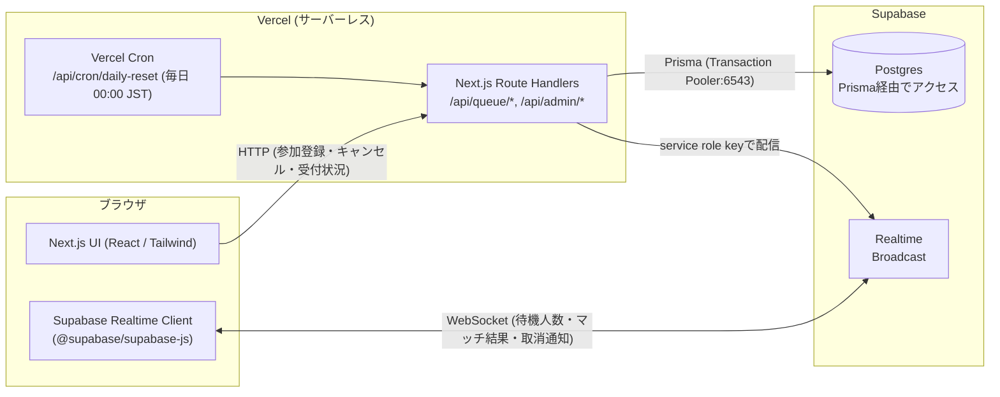
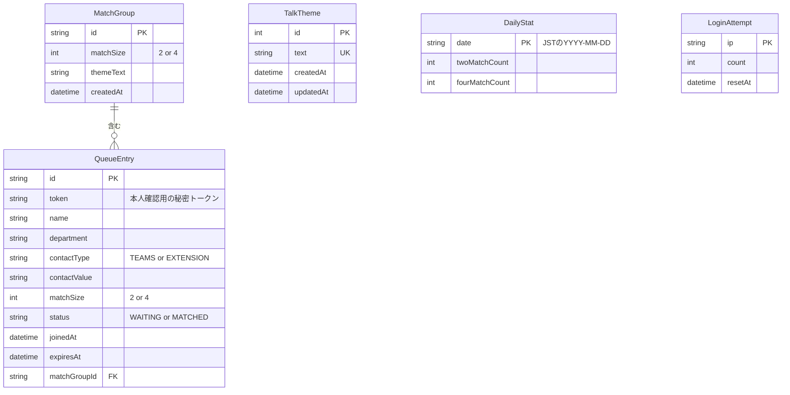
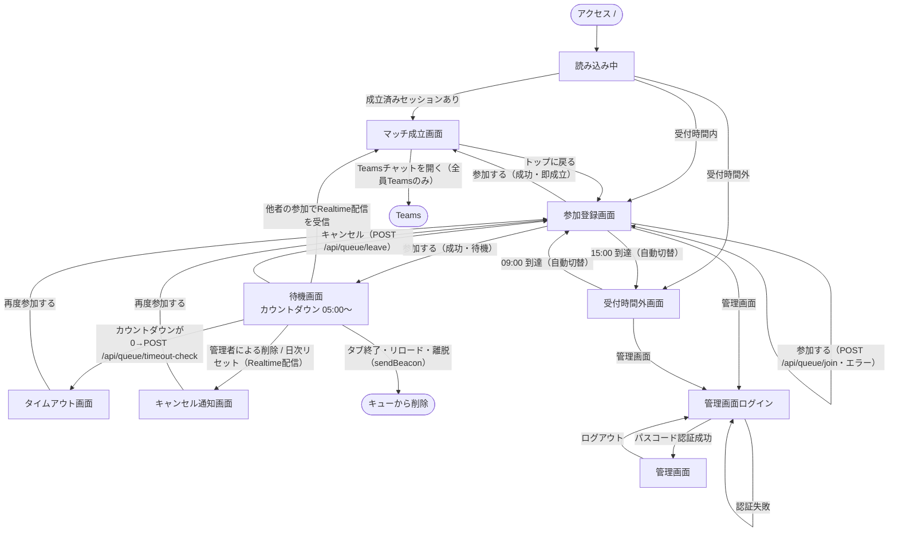
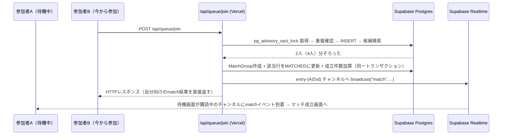

# 設計資料（Vercel + Supabase 版）

Docker版との最大の違いは「常時起動のNode.jsサーバーを持たない」ことです。
Vercelはリクエストが来た瞬間だけ関数を起動する**サーバーレス**環境のため、Socket.IOのような
「接続を張りっぱなしにするサーバー」は使えません。この版では、

- リアルタイム配信 → **Supabase Realtime**（クライアントがSupabaseへ直接WebSocket接続）
- 排他制御（同時参加の直列化） → **Postgresのアドバイザリロック**（`pg_advisory_xact_lock`）
- 定期処理（日次リセット） → **Vercel Cron**
- 離脱検知 → **`navigator.sendBeacon` + サーバー側の期限切れ判定**

に置き換えています。

## 1. システム構成図

## 2. ER図

> Docker版にあった `socketId` 列は不要になりました（接続の生存確認をSocket.IOに頼らないため）。
> 代わりに `LoginAttempt` テーブルを追加しています（サーバーレスはプロセスをまたぐため、ログイン試行回数をメモリではなくDBで管理する必要があるため）。

## 3. 画面遷移図

## 4. マッチング成立時のシーケンス

## 5. API一覧

| メソッド | パス | 認証 | 概要 |
| --- | --- | --- | --- |
| GET | `/api/health` | 不要 | ヘルスチェック（DB疎通確認） |
| GET | `/api/service-status` | 不要 | 受付中/時間外の判定結果 |
| GET | `/api/queue/status` | 不要 | 待機人数（2人 / 4人） |
| POST | `/api/queue/join` | 不要 | 参加登録（Socket.IO版の`queue:join`相当） |
| POST | `/api/queue/leave` | 本人トークン | 待機キャンセル・離脱通知（`sendBeacon`からも呼ばれる） |
| POST | `/api/queue/timeout-check` | 本人トークン | 待機カウントダウン0時のサーバー側期限確認 |
| GET | `/api/match/result?entryId=&token=` | 本人トークン | 成立済みマッチ結果の再取得 |
| POST | `/api/admin/login` | 不要 | パスコード認証・セッションCookie発行 |
| POST | `/api/admin/logout` | 不要 | セッションCookie破棄 |
| GET | `/api/admin/session` | 不要 | ログイン状態の確認 |
| GET | `/api/admin/dashboard` | 管理者 | 待機一覧・待機人数・当日成立件数 |
| DELETE | `/api/admin/queue` | 管理者 | 全待機データ削除（緊急機能） |
| GET/POST | `/api/admin/themes` | 管理者 | トークテーマ一覧・追加 |
| PUT/DELETE | `/api/admin/themes/:id` | 管理者 | トークテーマ編集・削除 |
| GET/POST | `/api/cron/daily-reset` | `CRON_SECRET` | 日次リセット（Vercel Cronから毎日 15:00 UTC = 00:00 JST に起動） |

## Supabase Realtime チャンネル

| チャンネル | イベント | 配信範囲 | 概要 |
| --- | --- | --- | --- |
| `queue-status` | `status` | 全員 | `{ two, four }` 待機人数のみ（個人情報なし） |
| `entry-{entryId}` | `match` | 本人のみ（購読者がentryIdを知っている前提） | マッチ成立時に他メンバーへ配信するMatchResult |
| `entry-{entryId}` | `cancelled` | 本人のみ | 管理者削除・日次リセットによる取り消し通知 |

`entryId`（cuid）は第三者が推測できない前提のPoC設計です。より厳格にするなら、Supabase Realtimeの
Authorization機能（チャンネルごとのアクセス制御）を追加してください。

## 6. サーバーレス特有の設計判断

| 項目 | Docker版 | Vercel + Supabase版 |
| --- | --- | --- |
| 排他制御 | プロセス内Promiseチェーン | Postgres `pg_advisory_xact_lock`（DB側で直列化） |
| リアルタイム配信 | Socket.IO（同一サーバー内） | Supabase Realtime Broadcast |
| 離脱検知 | WebSocket `disconnect` | `navigator.sendBeacon` + 期限切れによる自然消滅 |
| タイムアウト監視 | 1秒毎のインターバル | クライアント側カウントダウン0時にサーバー確認（`/api/queue/timeout-check`） |
| 日次リセット | `setInterval`で日付跨ぎを検知 | Vercel Cron（`vercel.json`、毎日1回） |
| 管理画面ログインのレート制限 | プロセス内Map | `LoginAttempt`テーブル（Postgres） |

### なぜ「1秒毎の監視」をやめてよいのか

`getQueueStatus` と `getDashboard` は `expiresAt > now` の行だけを数えるようにしているため、
期限切れの行がDBに残っていても、待機人数・マッチング候補には一切影響しません。
そのため、期限切れ行の物理的な削除は「毎日1回のお掃除」で十分です（Vercel Hobbyプランの
Cron頻度が1日1回までに制限されていることとも相性が良い設計です）。
本人の待機画面のカウントダウンは、0になった瞬間にクライアントから
`/api/queue/timeout-check` を呼び、その場でサーバーに確認しています。
